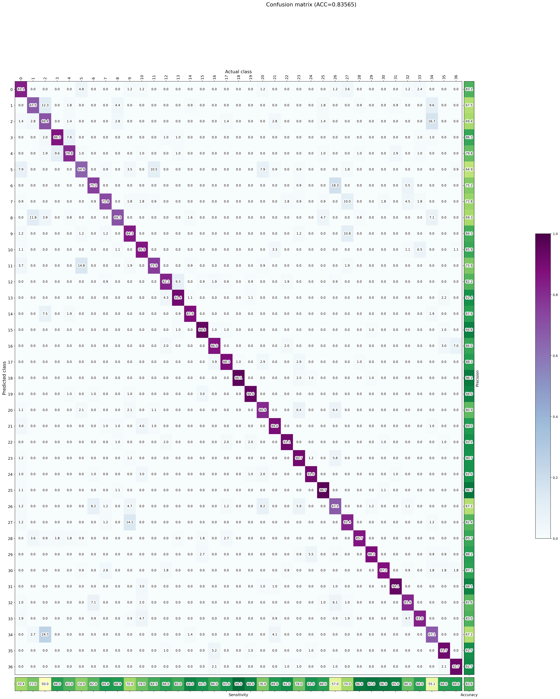
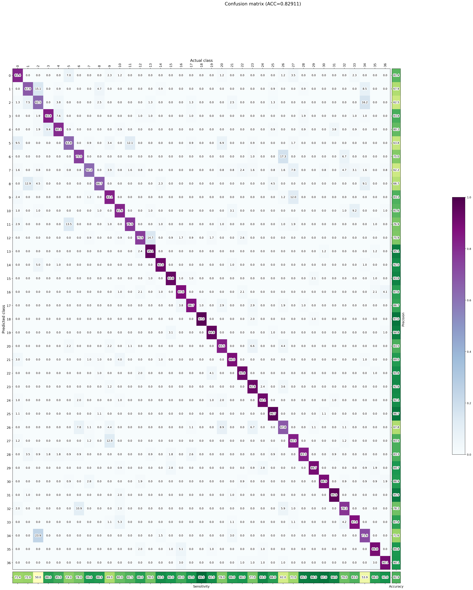

# Raport z eksperymentów: Kwantyzacja modelu TensorFlow

## Informacje o sprzęcie
```
CPU: AMD Ryzen 5 5600 6-Core Processor
- Liczba CPU(s): 12 (6 rdzeni fizycznych, 2 wątki na rdzeń)
- Jest to liczba logicznych procesorów (wątki), nie rdzeni fizycznych.

RAM: 32 GiB (na podstawie `lshw -c memory`)
```

---

## Porównanie modeli

| Model              | Accuracy | Precision | G-Mean | Inference Time (ms) |
|--------------------|----------|-----------|--------|---------------------|
| `native`           | 0.836    | 0.835     | 0.831  | 47.04               |                     |
| `tflite-fp32`      | 0.836    | 0.835     | 0.831  | 4.17                |
| `tflite-int8-0.01` | 0.831    | 0.830     | 0.828  | 3.76                |
| `tflite-int8-0.08` | 0.827    | 0.826     | 0.824  | 3.71                |
| `tflite-int8-0.3`  | 0.826    | 0.826     | 0.824  | 3.69                |
| `tflite-int8-0.8`  | 0.829    | 0.829     | 0.826  | 3.78                |
| `tflite-imbint8`   | 0.828    | 0.828     | 0.825  | 3.74                |

---

## Liczba parametrów modelu

Zgodnie z `model.summary()` – 4,164,967 parametrów

---

## Rozmiar modelu
FP32 TFLite model: ~16.48 MB

INT8 model: ~4.5 MB

---

## Wnioski

### 1. FP32 vs Native

- `tflite-fp32` daje **identyczną jakość** jak `native`, ale jest **\~11x szybszy**.

### 2. Kwantyzacja INT8

- Modele INT8 mają **niewielki spadek jakości** (do 1%), ale oferują jeszcze **większe przyspieszenie**.
- Rozmiar modelu jest około **4 razy** mniejszy

### 3. Kalibracja a jakość INT8

- Najlepszy wynik miał model z kalibracją na **0.01** zbioru – możliwe, że dane były dobrze reprezentatywne.
- Modele z większym procentem kalibracji mają podobną jakość, bez wyraźnej poprawy.

### 4. `tflite-imbint8` – kalibracja tylko na jednej klasie

- Zaskakująco dobre wyniki – tylko ok. **0.003 różnicy** accuracy względem najlepszego modelu INT8.
- Może oznaczać, że sieć dobrze generalizuje lub że klasa `5` jest dominująca w zbiorze.

---

## Confusion Matrix (do wglądu)
### Native

### FP32

### INT8-0.01

### INT8-0.08

### INT8-0.3

### INT8-0.8

### IMB INT8

