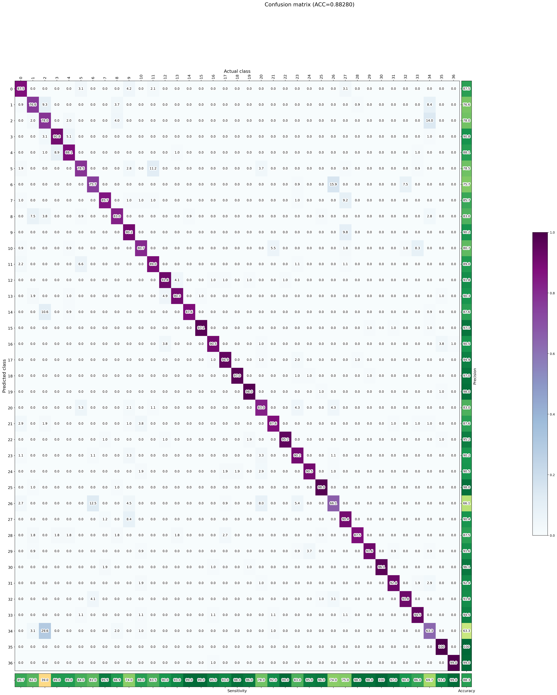
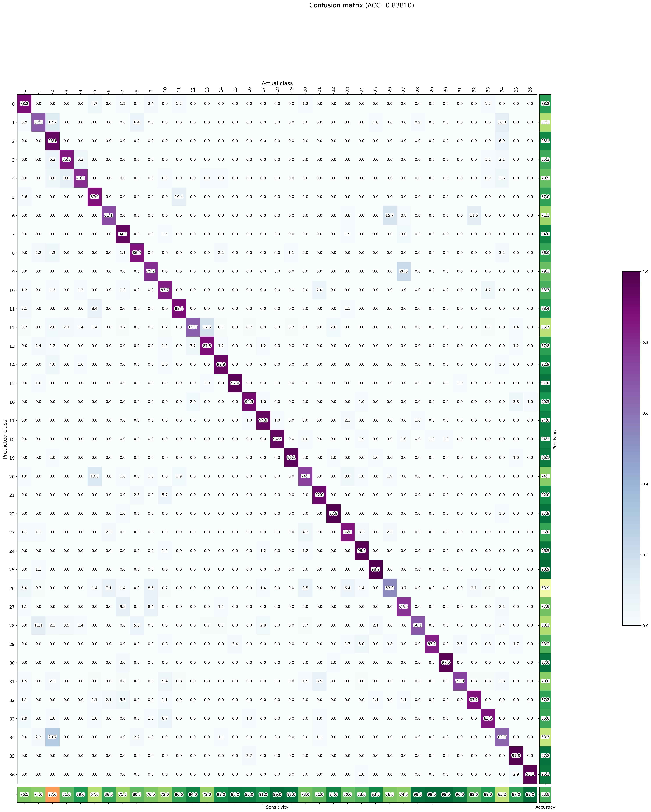
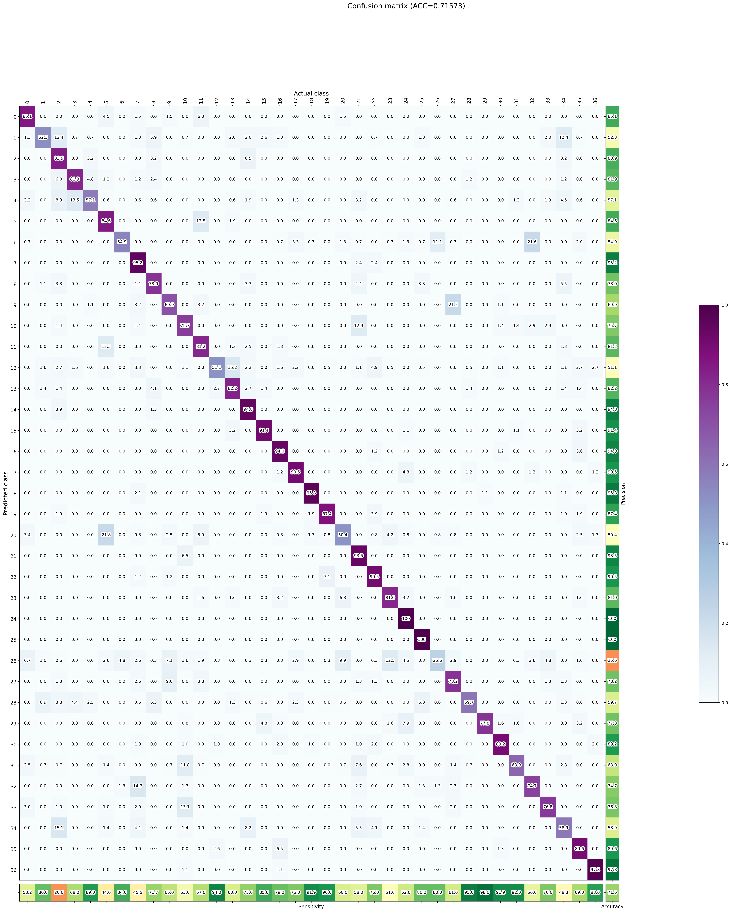
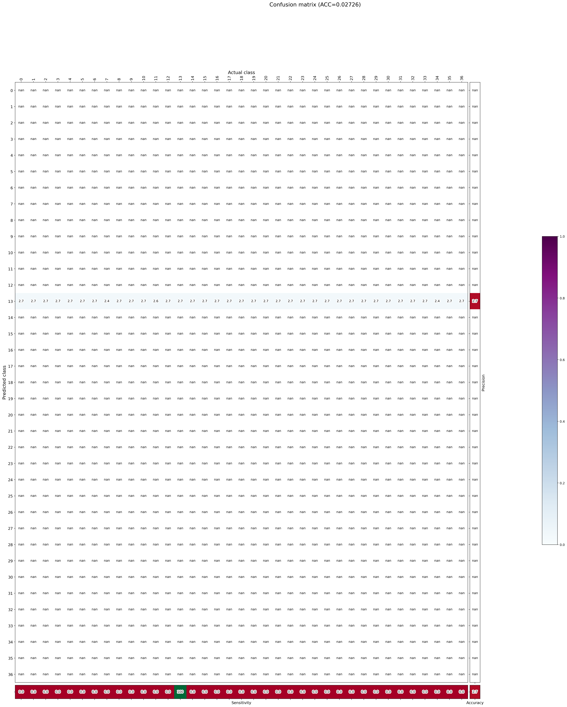
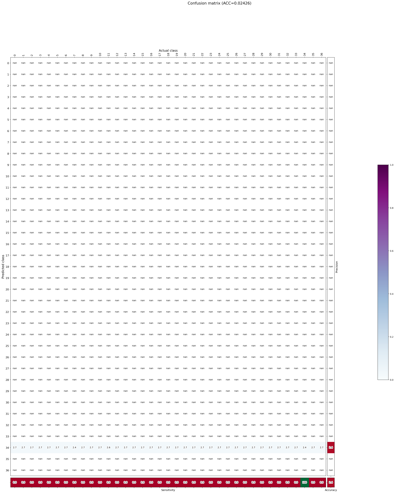
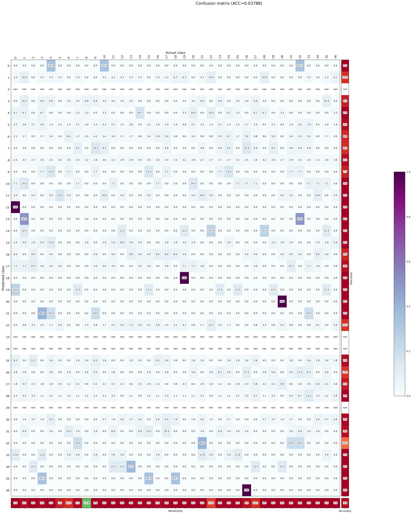
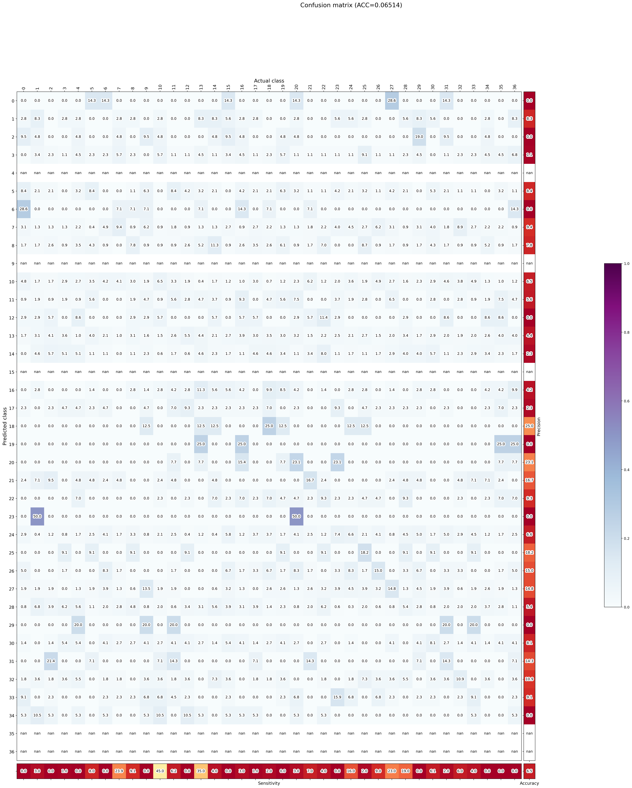
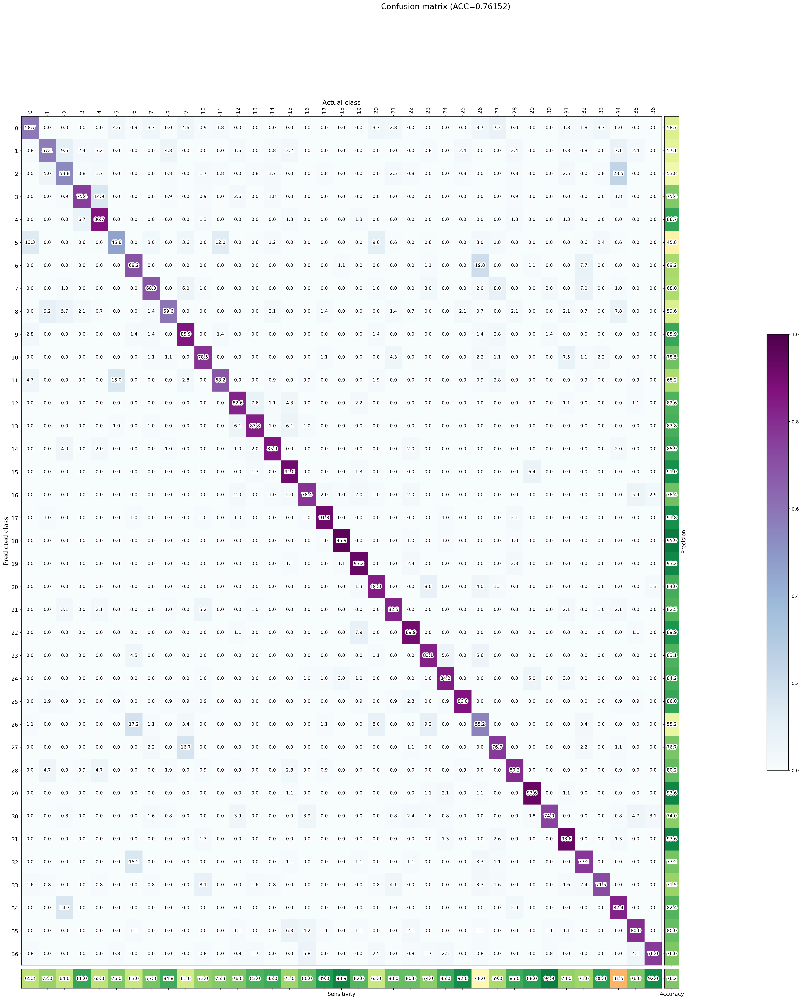

# Podsumowanie eksperymentów – Pruning, Clustering

## Wyniki eksperymentów
### Pruned Models

| Model           | Accuracy | Precision | Sensitivity | G-Mean | Inference Time |
|-----------------|----------|-----------|-------------|--------|----------------|
| Pruned-0.2-fp32 | 88.5%    | 88.5%     | 88.5%       | 88.1%  | 4.74 ms        |
| Pruned-0.4-fp32 | 83.8%    | 83.7%     | 85.2%       | 84.4%  | 4.69 ms        |
| Pruned-0.5-fp32 | 71.6%    | 71.4%     | 78.2%       | 75.9%  | 5.09 ms        |

#### Pruned 20%

#### Pruned 40%

#### Pruned 50%

---

### Clustered Models

| Model             | Accuracy | Precision | Sensitivity | G-Mean | Inference Time |
|-------------------|----------|-----------|-------------|--------|----------------|
| Clustered-2-fp32  | 2.73%    | 2.70%     | brak        | brak   | 4.87 ms        |
| Clustered-4-fp32  | 2.75%    | 2.76%     | brak        | brak   | 4.76 ms        |
| Clustered-8-fp32  | 6.49%    | 6.50%     | brak        | brak   | 4.49 ms        |
| Clustered-16-fp32 | 79.9%    | 79.7%     | 80.9%       | 79.9%  | 5.30 ms        |
| Clustered-32-fp32 | 83.4%    | 83.3%     | 84.5%       | 83.6%  | 4.69 ms        |

#### Clustered 2

#### Clustered 4

#### Clustered 8

#### Clustered 16

#### Clustered 32

---

### Quantized vs FP32 baseline (Przypomnienie)

| Model            | Accuracy | Precision | Sensitivity | G-Mean | Inference Time |
|------------------|----------|-----------|-------------|--------|----------------|
| TFLite FP32      | 83.6%    | 83.5%     | 83.6%       | 83.1%  | 4.17 ms        |
| TFLite INT8      | 83.1%    | 83.0%     | 83.4%       | 82.8%  | 3.88 ms        |

## Deflation ZIP – Pruning i Clustering

| Model        | Deflation |
|--------------|-----------|
| Clustered-2  | 92%       |
| Clustered-4  | 86%       |
| Clustered-8  | 81%       |
| Clustered-16 | 76%       |
| Clustered-32 | 70%       |
| Pruned-0.2   | 20%       |
| Pruned-0.4   | 35%       |
| Pruned-0.5   | 43%       |

## Odpowiedzi na pytania

### Tabela porównawcza dokładności - Clustering vs Pruning

| Metoda     | Wariant            | Accuracy | G-Mean |
|------------|--------------------|----------|--------|
| Clustering | Clustered-2        | 2.73%    | brak   |
| Clustering | Clustered-4        | 2.75%    | brak   |
| Clustering | Clustered-8        | 6.49%    | brak   |
| Clustering | Clustered-16       | 79.9%    | 79.9%  |
| Clustering | Clustered-32       | 83.4%    | 83.6%  |
| Pruning    | Pruned-0.2         | 88.5%    | 88.1%  |
| Pruning    | Pruned-0.4         | 83.8%    | 84.4%  |
| Pruning    | Pruned-0.5         | 71.6%    | 75.9%  |

### Tabela porównawcza metod - Wady i zalety

| Metoda       | Zalety                                                                    | Wady                                                                |
|--------------|---------------------------------------------------------------------------|---------------------------------------------------------------------|
| Quantization | Najmniejszy rozmiar modelu; szybki inference na CPU; niskie zużycie RAM   | Potencjalny spadek dokładności; wymaga wsparcia sprzętowego         |
| Pruning      | Dobry kompromis jakość/rozmiar; łatwy do wdrożenia                        | Wydajność zależna od sparsity i implementacji sprzętowej            |
| Clustering   | Stabilna dokładność przy większej liczbie klastrów; dobra kompresowalność | Niższa dokładność przy małej liczbie klastrów; wolniejszy inference |

### Rozmiary modeli vs FP32 TFLite

| Model        | Rozmiar |
|--------------|---------|
| Clustered-2  | 1.3 MB  |
| Clustered-4  | 2.2 MB  |
| Clustered-8  | 3.0 MB  |
| Clustered-16 | 3.8 MB  |
| Clustered-32 | 4.8 MB  |
| Pruned-0.2   | 13 MB   |
| Pruned-0.4   | 11 MB   |
| Pruned-0.5   | 9.0 MB  |
| FP32         | 31 MB   |

### Co to jest "deflation" w ZIP i jak to się ma do optymalizacji?

"Deflation" to procent redukcji rozmiaru pliku przy kompresji ZIP.
Przykład: model ma 4 MB, ZIP ma 2 MB = deflation 50%.
Im bardziej model zawiera powtarzające się wzorce (np. przez clustering, pruning), tym większy deflation.
Po kwantyzacji deflation jest zazwyczaj niewielkie (ok. 10%), ponieważ dane są już zoptymalizowane pod kątem rozmiaru i zawierają mało powtarzalnych sekwencji binarnych.

### Najlepsza metoda?

- **Najmniejszy rozmiar**: zazwyczaj INT8 quantization.
- **Najlepsza jakość przy kompresji**: pruning + fine-tuning lub clustering.

Nie ma jednej "najlepszej" metody - wszystko zależy od wymagań (np. rozmiar vs jakość vs inference time), a każda metoda ma swoje wady i zalety.

# Structured Pruning z NNI – FashionMNIST
## Redukcja parametrów (Structured Pruning)

| Warstwa | Przed | Po  | Redukcja |
| ------- | ----- | --- | -------- |
| Conv1   | 8     | 4   | 50%      |
| Conv2   | 16    | 8   | 50%      |
| Conv3   | 32    | 16  | 50%      |
| FC1     | 1024  | 512 | 50%      |

> Warstwa FC2 została **wykluczona z pruningu** bo jest warstwą wyjściową.

---

## Jakość modelu

| Etap                        | Accuracy  | Inference Time |
|-----------------------------|-----------|----------------|
| **Oryginalny model**        | 87.16%    | 1.98 ms        |
| **Po pruning (bez tuning)** | 42.65%    | 0.38 ms        |
| **Po fine-tuningu**         | **87.8%** | **0.51 ms**    |

---

## Wnioski

* Structured pruning **zmniejszył liczbę parametrów o \~50%** w wybranych warstwach.
* **Inference time** skrócił się ponad **trzykrotnie** (z 1.98 ms do \~0.5 ms).
* Początkowy spadek jakości po pruning był duży, ale fine-tuning pozwolił **odzyskać porównywalną dokładność do modelu pełnego**, przy znacznie mniejszym obciążeniu.
